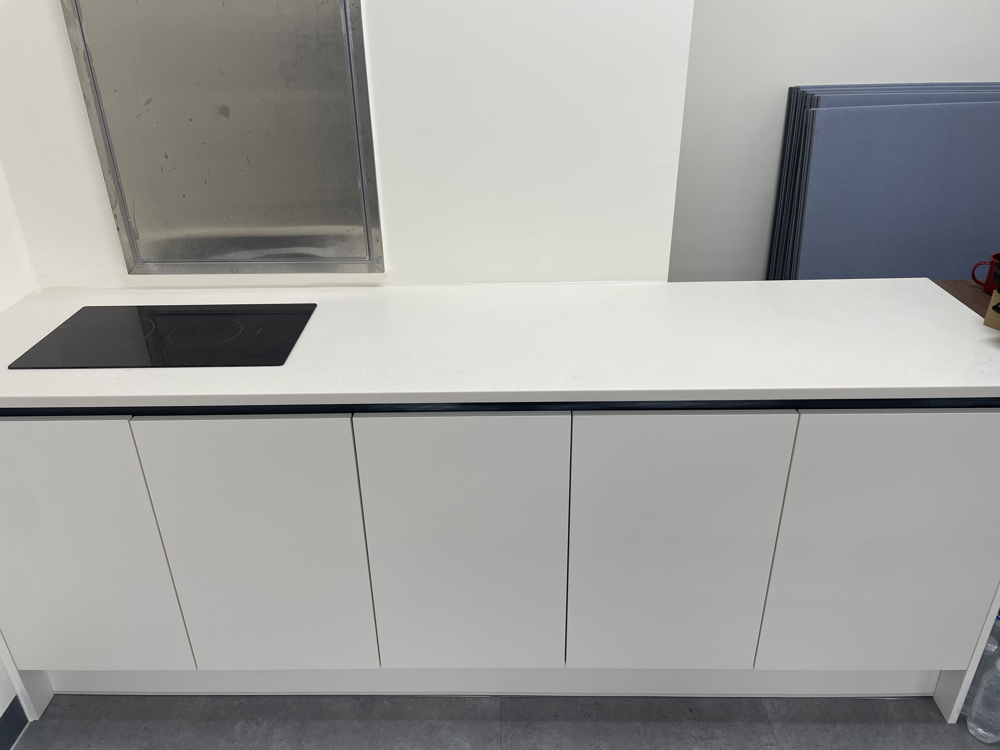
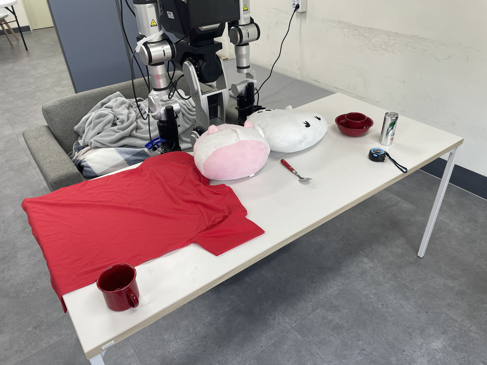
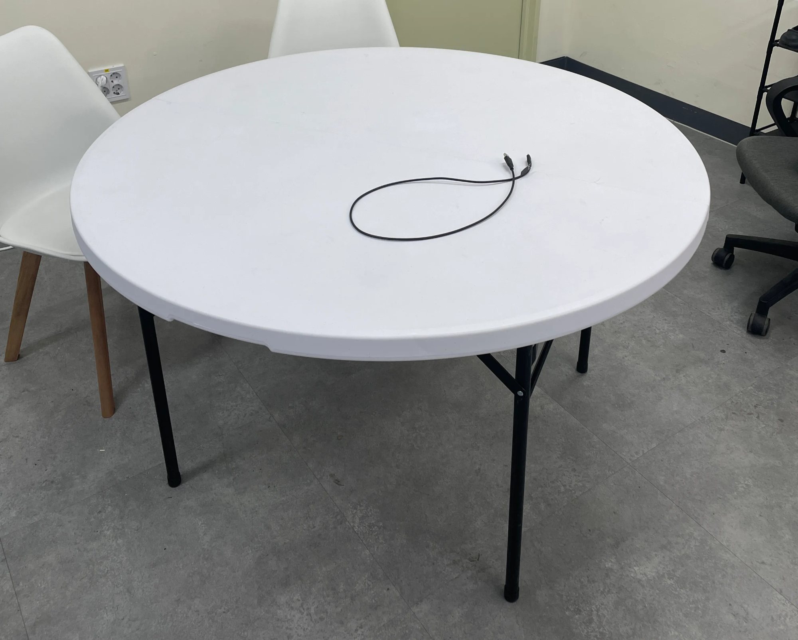
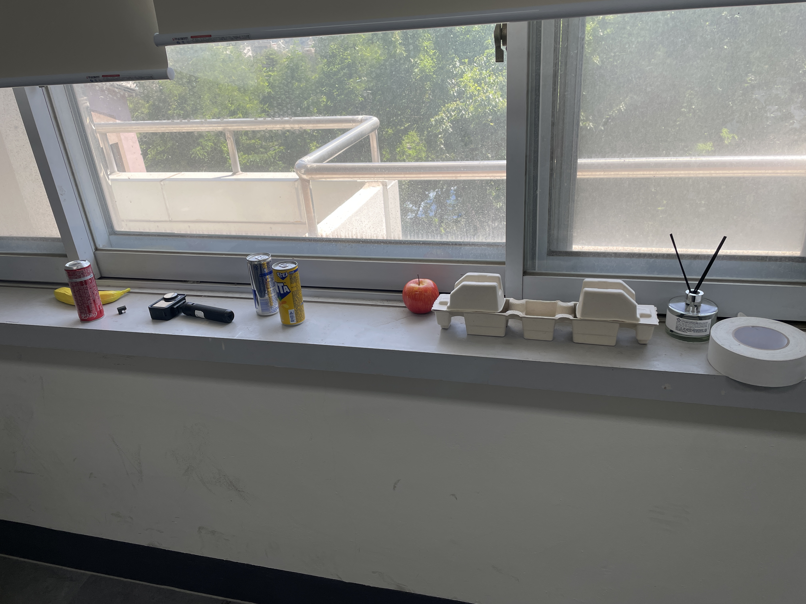
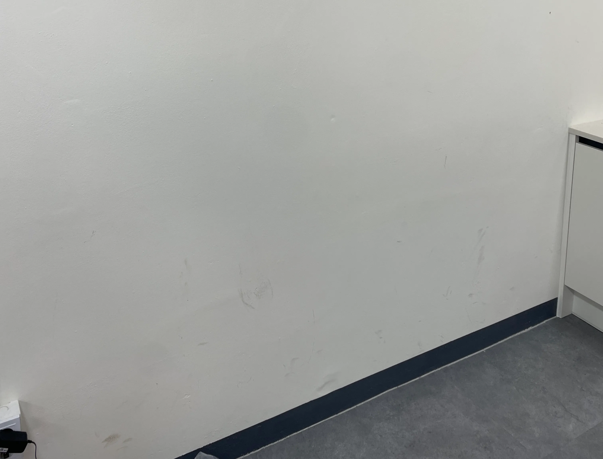
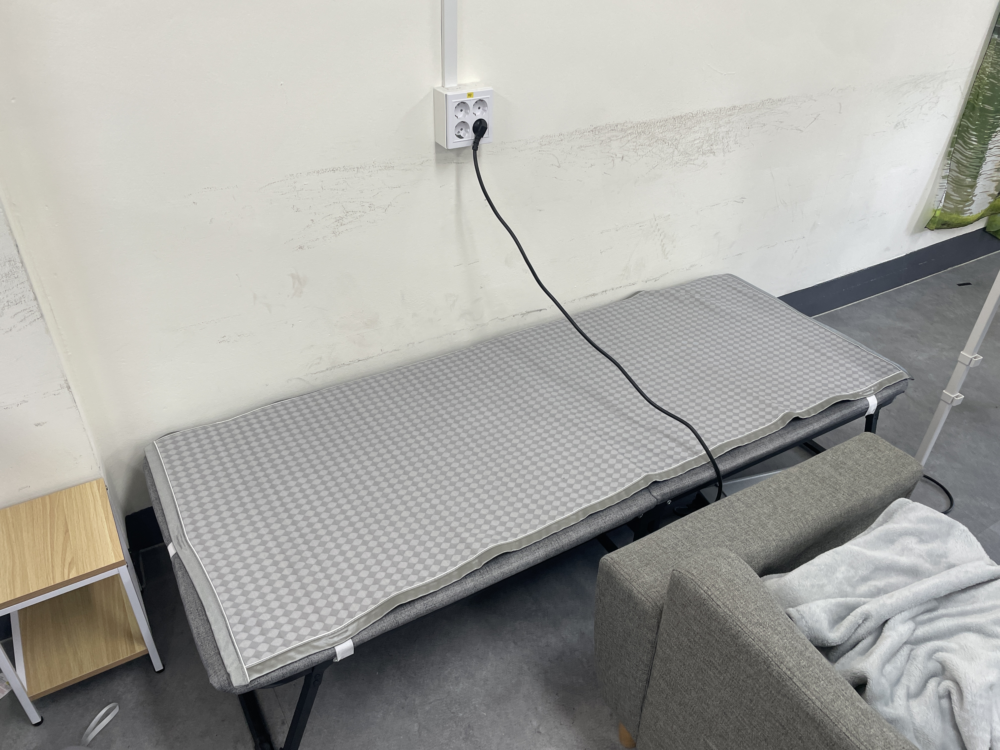

  <h1> Find Plane with RANSAC</h1>
  
  
  

# What is this
This repository is used in RoboCup Restaurant to rotate around and determine the initial location of the bar, and to estimate the height of the plane on which an object is placed when the robot needs to approach a specific table or object for manipulation.

# Evaluation
All evaluations were conducted five times, and the bag files used for the evaluations are provided in the link below.

|object|distance|left|rigjt|front|
|---|---|---|---|---|
|dinning bar|40cm|0%|0%|100%|
|dinning bar|100cm|0%|0%|100%|
|dinning bar|130cm|0%|0%|0%|
|desk|50cm|100%|100%|100%|
|desk|90cm|0%|0%|100%|
|cabinet|50cm|0%|0%|100%|
|cabinet|80cm|0%|0%|100%|
|cabinet|120cm|0%|0%|0%|
|cabinet|150cm|0%|0%|0%|
|round table|30cm|0%|0%|100%|
|round table|60cm|0%|0%|100%|
| |||||
|Wall 1|30cm|||100%|
|Wall 2|30cm|||0%|
|person|60cm|||0%|
|person|120cm|||0%|
|30cm sofa|50cm|||0%|
|36cm bed|50cm|||0%|

## Evaluation Location
|dinning bar|desk|cabinet|round table|
|---|---|---|---|
|||||

|Wall 1|Wall 2|30cm sofa|36cm bed|
|---|---|---|---|
|||||

### bag files link
[data download link](https://drive.google.com/drive/folders/1vo3dpQZectz0yMZg8Xb8tFdSDBF-ypoW?usp=drive_link)